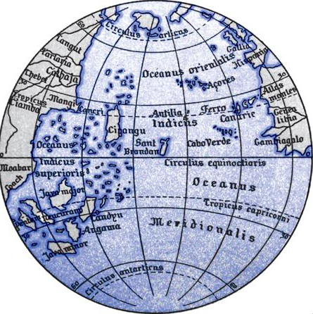
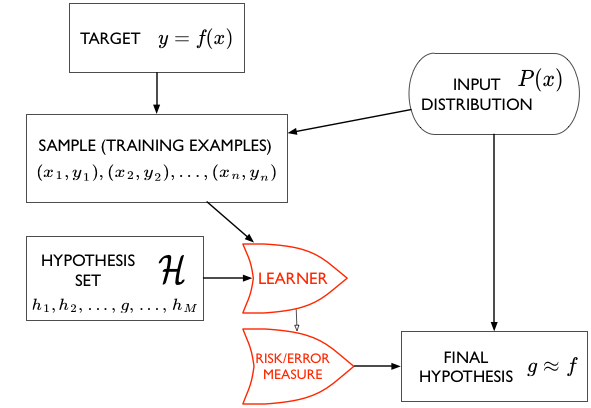
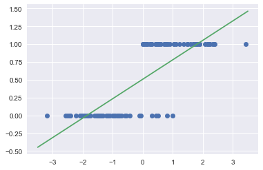

autoscale: true

#[fit]Day 1 Session 1

## Linear Regression with
## Gradient Descent

---

#[fit]REGRESSION

- how many dollars will you spend?
- what is your creditworthiness
- how many people will vote for Bernie t days before election
- use to predict probabilities for classification
- causal modeling in econometrics


---


# HYPOTHESIS SPACES

A polynomial looks so:

 $$h(x) = \theta_0 + \theta_1 x^1 + \theta_2 x^2 + ... + \theta_n x^n = \sum_{i=0}^{n} \theta_i x^i$$

All polynomials of a degree or complexity $$d$$ constitute a hypothesis space.

$$ \cal{H}_1: h_1(x) = \theta_0 + \theta_1 x $$
$$ \cal{H}_{20}: h_{20}(x) = \sum_{i=0}^{20} \theta_i x^i$$

---

## SMALL World vs BIG World

- *Small World* answers the question: given a model class (i.e. a Hypothesis space, whats the best model in it). It involves parameters. Its model checking.
- *BIG World* compares model spaces. Its model comparison with or without "hyperparameters".



---



[^*]

[^*]: image based on amlbook.com

---

Linear Regression

$$\hat{y} = f_\theta (x) =\theta^T x$$

Cost Function:

$$R(\theta) = \frac{1}{2} \sum_{i=1}^m (f_\theta (x^{(i)}-y^{(i)})^2$$

###[fit] MINIMIZE SQUARED ERROR

---

## Gradient ascent (descent)

basically go opposite the direction of the derivative.

Consider the objective function: $$ J(x) = x^2-6x+5 $$

```python
gradient = fprime(old_x)
move = gradient * step
current_x = old_x - move
```


---

## good step size


---

## too big step size


---

## too small step size


---

## Gradient Descent

$$\theta := \theta - \eta \nabla_{\theta} R(\theta) = \theta -\eta \sum_{i=1}^m \nabla R_i(\theta)$$

where $$\eta$$ is the learning rate.

ENTIRE DATASET NEEDED

```python
for i in range(n_epochs):
  params_grad = evaluate_gradient(loss_function, data, params)
  params = params - learning_rate * params_grad`
```

---

## Linear Regression: Gradient Descent

$$\theta_j := \theta_j + \alpha \sum_{i=1}^m (y^{(i)}-f_\theta (x^{(i)})) x_j^{(i)}$$


---

## Stochastic Gradient Descent

$$\theta := \theta - \alpha \nabla_{\theta} R_i(\theta)$$


ONE POINT AT A TIME

For Linear Regression: 

$$\theta_j := \theta_j + \alpha (y^{(i)}-f_\theta (x^{(i)})) x_j^{(i)}$$

```python
for i in range(nb_epochs):
  np.random.shuffle(data)
  for example in data:
    params_grad = evaluate_gradient(loss_function, example, params)
    params = params - learning_rate * params_grad
```

---

Mini-Batch SGD (the most used)

$$\theta := \theta - \eta \nabla_{\theta} J(\theta; x^{(i:i+n)}; y^{(i:i+n)})$$

```python
for i in range(mb_epochs):
  np.random.shuffle(data)
  for batch in get_batches(data, batch_size=50):
    params_grad = evaluate_gradient(loss_function, batch, params)
    params = params - learning_rate * params_grad
```

---
[.autoscale: true]

## Mini-Batch: do some at a time

- the risk surface changes at each gradient calculation
- thus things are noisy
- cumulated risk is smoother, can be used to compare to SGD
- epochs are now the number of times you revisit the full dataset
- shuffle in-between to provide even more stochasticity

---


---


##[fit] Frequentist 
##[fit] Statistics

---

Answers the question: 

**What is Data?** 

with

>"data is a **sample** from an existing **population**"

- data is stochastic, variable
- model the sample. The model may have parameters
- find parameters for our sample. The parameters are considered **FIXED**.

---

## Likelihood

How likely it is to observe values $$x_1,...,x_n$$ given the parameters $$\lambda$$?

$$
L(\lambda) = \prod_{i=1}^n P(x_i | \lambda)
$$

How likely are the observations if the model is true?

---

## Maximum Likelihood estimation


---

We have data on the wing length in millimeters of a nine members of a particular species of moth. We wish to make inferences from those measurements on the population quantities $$\mu$$ and $$\sigma$$.


Y = [16.4, 17.0, 17.2, 17.4, 18.2, 18.2, 18.2, 19.9, 20.8]

Let us assume a gaussian pdf:

$$p(y \vert \mu, \sigma^2) =  \frac{1}{ \sqrt{ 2 \pi \sigma^2}} e^{-( \frac{y-\mu}{2 \sigma})^2}$$

---

Gaussian Distribution


---

## MLE Estimators

LIKELIHOOD: $$p(y_1, \ldots, y_n \vert \mu, \sigma^2) = 
\prod_{i=1}^{n} p(y_i \vert \mu, \sigma^2)$$

$$=\prod_{i=1}^{n}  \frac{1}{ \sqrt{ 2 \pi \sigma^2}} e^{-( \frac{(y_i-\mu)^2}{2\sigma^2})} = 
\frac{1}{ \sqrt{ 2 \pi \sigma^2}}   \exp \left\{  - \frac{1}{2}  \sum_i \frac{(y_i-\mu)^2}{\sigma^2} \right\}$$

Take partials for $$\hat{\mu}_{MLE}$$ and $$\hat{\sigma}^2_{MLE}$$

---

## MLE for Moth Wing

$$\hat{\mu}_{MLE} = \frac{1}{N}\sum_i y_i = \bar{Y};\,\, \hat{\sigma}^2_{MLE}  = \frac{1}{N} \sum_i (Y_i - \bar{Y}^2)$$

$$\hat{\sigma}^2_{MLE}$$ is a biased estimator of the population variance, while $$\hat{\mu}_{MLE}$$ is an unbiased estimator.

That is, $$E_{D}[\hat{\mu}_{MLE}] = \mu$$, where the $$D$$ subscripts means the expectation with respect to the predictive, or data-sampling, or data generating distribution.

VALUES: `sigma 1.33 mu 18.14`

---

## Example Exponential Distribution Model

$$
f(x;\lambda) = \begin{cases}
\lambda e^{-\lambda x} & x \ge 0, \\
0 & x < 0.
\end{cases}
$$

Describes the time between events in a homogeneous Poisson process (events occur at a constant average rate). Eg time between buses arriving.

---

## log-likelihood

Maximize the likelihood, or more often (easier and more numerically stable), the log-likelihood

$$
\ell(\lambda) = \sum_{i=1}^n ln(P(x_i \mid \lambda))
$$

In the case of the exponential distribution we have:

$$
\ell(lambda) = \sum_{i=1}^n ln(\lambda e^{-\lambda x_i}) = \sum_{i=1}^n \left( ln(\lambda) - \lambda x_i \right).
$$

---

Maximizing this:

$$
\frac{d \ell}{d\lambda} = \frac{n}{\lambda} - \sum_{i=1}^n x_i = 0
$$

and thus:

$$
\frac{1}{\hat{\lambda_{MLE}}} = \frac{1}{n}\sum_{i=1}^n x_i,
$$

which is the sample mean of our sample.

---


## True vs estimated

If your model describes the true generating process for the data, then there is some true $$\mu^*$$.

We dont know this. The best we can do is to estimate $$\hat{\mu}$$.

Now, imagine that God gives you some M data sets **drawn** from the population, and you can now find $$\mu$$ on each such dataset.

So, we'd have M estimates.

---

## M samples of N data points


---

## Sampling distribution

As we let $$M \rightarrow \infty$$, the distribution induced on $$\hat{\mu}$$ is the empirical **sampling distribution of the estimator**.

$$\mu$$ could be $$\lambda$$, our parameter, or a mean, a variance, etc

We could use the sampling distribution to get confidence intervals on $$\lambda$$.

But we dont have M samples. What to do?

---

### REGRESSION


---

## Regression Noise Sources

- lack of knowledge of the true generating process
- sampling
- measurement error
- lack of knowledge of $$x$$

No more $$y = f(x)$$. Need $$y=f(x) + \epsilon$$.

or a $$P(y \mid x)$$

---


---

[^*]


---
## Gaussian Distribution assumption

$$\renewcommand{\v}[1]{\mathbf #1}$$
Each $$y_i$$ is gaussian distributed with mean  $$\mathbf{w}\cdot\mathbf{x}_i$$ (the y predicted by the regression line) and variance $$\sigma^2$$:


$$
\renewcommand{\v}[1]{\mathbf #1}
y_i \sim N(\v{w}\cdot\v{x_i}, \sigma^2) .$$

$$N(\mu, \sigma^2) = \frac{1}{\sigma\sqrt{2\pi}} e^{-(y - \mu)^2 / 2\sigma^2},$$

---

##  Linear Regression MLE


---

We can then write the likelihood:

$$
\renewcommand{\v}[1]{\mathbf #1}
\cal{L} = p(\v{y} | \v{x}, \v{w}, \sigma) = \prod_i p(\v{y}_i | \v{x}_i, \v{w}, \sigma)$$


$$\renewcommand{\v}[1]{\mathbf #1}
\cal{L} =  (2\pi\sigma^2)^{(-n/2)} e^{\frac{-1}{2\sigma^2} \sum_i (y_i -  \v{w}\cdot\v{x}_i)^2} .$$

The log likelihood $$\ell$$ then is given by:

$$\renewcommand{\v}[1]{\mathbf #1}
\ell = \frac{-n}{2} log(2\pi\sigma^2) - \frac{1}{2\sigma^2}  \sum_i (y_i -  \v{w}\cdot\v{x}_i)^2 .$$

---

## Maximizing gives:

$$\renewcommand{\v}[1]{\mathbf #1}
\v{w}_{MLE} = (\v{X}^T\v{X})^{-1} \v{X}^T\v{y}, $$

where we stack rows to get:

$$\renewcommand{\v}[1]{\mathbf #1}
\v{X} =  stack(\{\v{x}_i\})$$

$$\renewcommand{\v}[1]{\mathbf #1}
\sigma^2_{MLE} =  \frac{1}{n} \sum_i (y_i -  \v{w}\cdot\v{x}_i)^2  . $$

---

## Example: House Elections


---
[.autoscale: true]

## From Likelihood to Predictive Distribution

- the band on the previous graph is the sampling distribution of the regression line, or a representation of the sampling distribution of the $$\mathbf{w}$$.
- $$p(y \vert \mathbf{x},  \mu_{MLE}, \sigma^2_{MLE})$$ is a probability distribution
- thought of as $$p(y^{*} \vert \mathbf{x}^*, \{ \mathbf{x}_i, y_i\},  \mu_{MLE}, \sigma^2_{MLE})$$, it is a predictive distribution for as yet unseen data $$y^{*}$$ at $$\mathbf{x}^{*}$$, or the sampling distribution for data, or the data-generating distribution, at the new covariates $$\mathbf{x}^{*}$$. This is a wider band.

---


`Dem_Perc(t) ~ Dem_Perc(t-2) + I`

- done in statsmodels
- From Gelman and Hwang

---


#[fit]CLASSIFICATION

- will a customer churn?
- is this a check? For how much?
- a man or a woman?
- will this customer buy?
- do you have cancer?
- is this spam?
- whose picture is this?
- what is this text about?[^j]


[^j]:image from code in http://bit.ly/1Azg29G

---

## 1-D classification problem


---

## 1-D Using Linear regression



---

## Sigmoid function

This function is plotted below:

```python
h = lambda z: 1./(1+np.exp(-z))
zs=np.arange(-5,5,0.1)
plt.plot(zs, h(zs), alpha=0.5);
```


Identify: $$\renewcommand{\v}[1]{\mathbf #1} z = \v{w}\cdot\v{x}$$ and $$ \renewcommand{\v}[1]{\mathbf #1} h(\v{w}\cdot\v{x})$$ with the probability that the sample is a '1' ($$y=1$$).


---

## 1-D Using Logistic regression


---

## What is the sampling distribution?