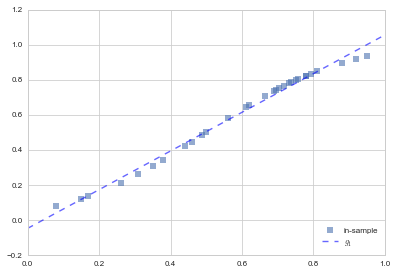
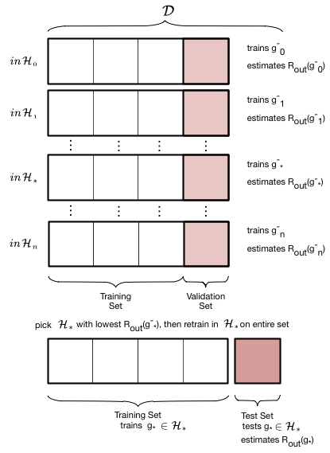
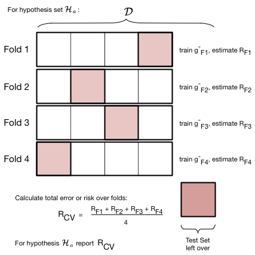

autoscale: true

#[fit]Day 1 Session 2

## Learning a Model
## Complexity, Validation, and Regularization

---

#[fit]RISK: What does it mean to FIT?

Minimize distance from the line?

$$R_{\cal{D}}(h_1(x)) = \frac{1}{N} \sum_{y_i \in \cal{D}} (y_i - h_1(x_i))^2 $$

Minimize squared distance from the line. Empirical Risk Minimization.

$$ g_1(x) = \arg\min_{h_1(x) \in \cal{H}} R_{\cal{D}}(h_1(x)).$$

##[fit]Get intercept $$w_0$$ and slope $$w_1$$.

---

#[fit] HYPOTHESIS SPACES

A polynomial looks so:

 $$h(x) = \theta_0 + \theta_1 x^1 + \theta_2 x^2 + ... + \theta_n x^n = \sum_{i=0}^{n} \theta_i x^i$$

All polynomials of a degree or complexity $$d$$ constitute a hypothesis space.

$$ \cal{H}_1: h_1(x) = \theta_0 + \theta_1 x $$
$$ \cal{H}_{20}: h_{20}(x) = \sum_{i=0}^{20} \theta_i x^i$$

---

## SMALL World vs BIG World

- *Small World* answers the question: given a model class (i.e. a Hypothesis space, whats the best model in it). It involves parameters. Its model checking.
- *BIG World* compares model spaces. Its model comparison with or without "hyperparameters".

---

#[fit] Approximation

## Learning Without Noise...

---

[^*]

[^*]: image based on amlbook.com

---

30 points of data. Which fit is better? Line in $$\cal{H_1}$$ or curve in $$\cal{H_{20}}$$?

---

# Bias or Mis-specification Error

---

## Sources of Variability

- sampling (induces variation in a mis-specified model)
- noise (the true $$p(y|x))$$
- mis-specification

---

## What is noise?

- noise comes from measurement error, missing features, etc
- sometimes it can be systematic as well, but its mostly random on account of being a combination of many small things...

---

# THE REAL WORLD HAS NOISE

### (or finite samples, usually both)

---

#Statement of the Learning Problem

The sample must be representative of the population!

$$A : R_{\cal{D}}(g) \,\,smallest\,on\,\cal{H}$$
$$B : R_{out} (g) \approx R_{\cal{D}}(g)$$

A: Empirical risk estimates in-sample risk.
B: Thus the out of sample risk is also small.

---

Which fit is better now?
                                              The line or the curve?

---

---

[^*]

---

## Training sets

- look at fits on different "training sets $${\cal D}$$"
- in other words, different samples
- in real life we are not so lucky, usually we get only one sample
- but lets pretend, shall we?

---

#UNDERFITTING (Bias) vs OVERFITTING (Variance)

---

# How do we estimate

# out-of-sample or population error $$R_{out}$$

#TRAIN AND TEST

---

#MODEL COMPARISON: A Large World approach

- want to choose which Hypothesis set is best
- it should be the one that minimizes risk
- but minimizing the training risk tells us nothing: interpolation
- we need to minimize the training risk but not at the cost of generalization
- thus only minimize till test set risk starts going up

---

## Complexity Plot

---

---

DATA SIZE MATTERS: straight line fits to a sine curve

Corollary: Must fit simpler models to less data! This will motivate the analysis of learning curves later.

---

##[fit] Do we still have a test set?

Trouble:

- no discussion on the error bars on our error estimates
- "visually fitting" a value of $$d \implies$$ contaminated test set.

The moment we **use it in the learning process, it is not a test set**.

---

#[fit]VALIDATION

- train-test not enough as we *fit* for $$d$$ on test set and contaminate it
- thus do train-validate-test

---

## usually we want to fit a hyperparameter

- we **wrongly** already attempted to fit $$d$$ on our previous test set.
- choose the $$d, g^{-*}$$ combination with the lowest validation set risk.
- $$R_{val}(g^{-*}, d^*)$$ has an optimistic bias since $$d$$ effectively fit on validation set

## Then Retrain on entire set!

- finally retrain on the entire train+validation set using the appropriate  $$d^*$$ 
- works as training for a given hypothesis space with more data typically reduces the risk even further.

---

#[fit]CROSS-VALIDATION

---

---

#[fit]CROSS-VALIDATION

#is

- a resampling method
- robust to outlier validation set
- allows for larger training sets
- allows for error estimates

Here we find $$d=3$$.

---

## Cross Validation considerations

- validation process as one that estimates $$R_{out}$$ directly, on the validation set. It's critical use is in the model selection process.
- once you do that you can estimate $$R_{out}$$ using the test set as usual, but now you have also got the benefit of a robust average and error bars.
- key subtlety: in the risk averaging process, you are actually averaging over different $$g^-$$ models, with different parameters.

---

[.autoscale: true]

##REGULARIZATION: A SMALL WORLD APPROACH

Keep higher a-priori complexity and impose a

##complexity penalty

on risk instead, to choose a SUBSET of $$\cal{H}_{big}$$. We'll make the coefficients small:

$$\sum_{i=0}^j \theta_i^2 < C.$$

---

---

#[fit]REGULARIZATION

$$\cal{R}(h_j) =  \sum_{y_i \in \cal{D}} (y_i - h_j(x_i))^2 +\alpha \sum_{i=0}^j \theta_i^2.$$

As we increase $$\alpha$$, coefficients go towards 0.

Lasso uses $$\alpha \sum_{i=0}^j |\theta_i|,$$ sets coefficients to exactly 0.

---

## Regularization with Cross-Validation

